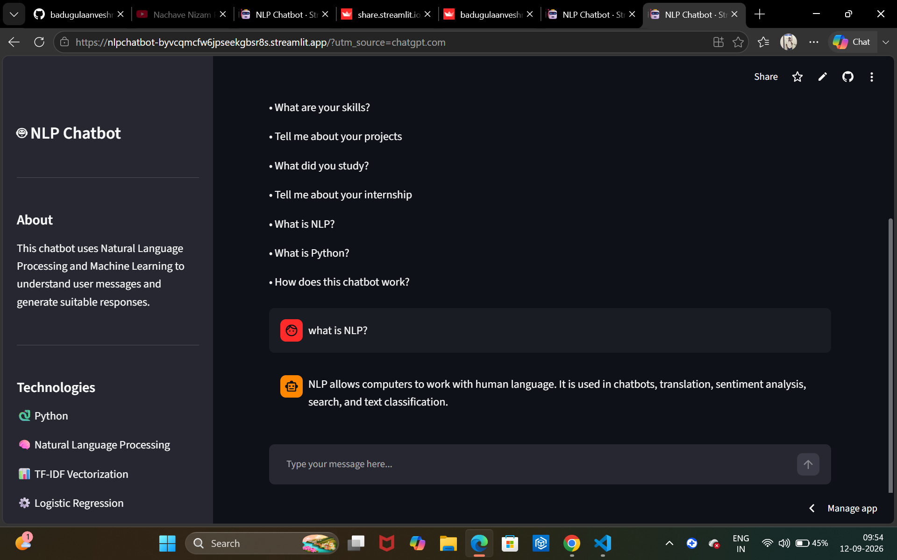

# 🤖 NLP Chatbot using Python and Machine Learning

An intelligent chatbot built using **Python, Natural Language Processing (NLP), TF-IDF Vectorization, and Logistic Regression**.

The chatbot identifies the intent of a user's message and generates an appropriate response based on a custom JSON dataset.

## 🚀 Live Demo

👉 [Try the NLP Chatbot](https://nlpchatbot-byvcqmcfw6jpseekgbsr8s.streamlit.app/)

## 💻 Source Code

👉 [View the GitHub Repository](https://github.com/badugulaanveshreddy/NLP_Chatbot)


### 🖥️ Application Preview



---

## 📌 Project Overview

This project demonstrates how Natural Language Processing and Machine Learning can be used to build a conversational chatbot.

The system takes a user's text input, processes the text, converts it into numerical features using TF-IDF, predicts the user's intent using Logistic Regression, and generates a suitable response.

The project also includes a **Streamlit web interface** for interacting with the chatbot.

---

## 🎯 Objectives

- Build a functional NLP-based chatbot.
- Create and manage a custom intent dataset.
- Apply text preprocessing techniques.
- Convert natural language into numerical features.
- Train a Machine Learning classification model.
- Predict user intent.
- Generate suitable responses.
- Build an interactive web interface using Streamlit.

---

## 🚀 Features

- Natural Language Processing
- Intent classification
- TF-IDF text vectorization
- Logistic Regression classification
- Custom JSON training dataset
- Multiple responses for each intent
- Confidence-based response handling
- Interactive command-line chatbot
- Streamlit web application
- Conversation history
- Modular project architecture

---

## 🧠 How the Chatbot Works

The chatbot follows this pipeline:

```text
User Input
     ↓
Text Preprocessing
     ↓
TF-IDF Vectorization
     ↓
Numerical Feature Representation
     ↓
Logistic Regression
     ↓
Intent Prediction
     ↓
Confidence Evaluation
     ↓
Response Generator
     ↓
Chatbot Response